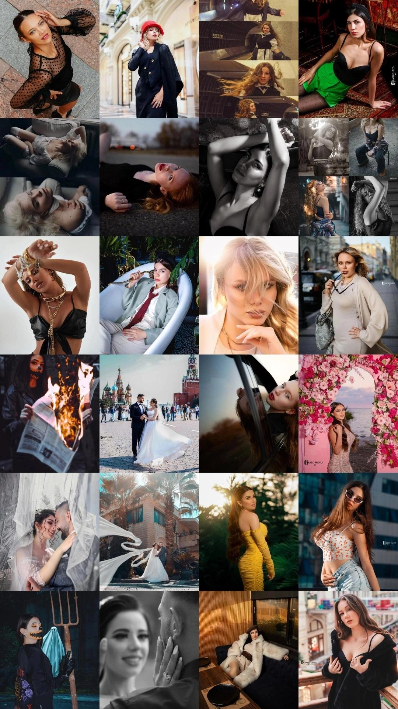

# SEO-аудит и план внедрения — фотостудия MOMENTA

**Объект:** `index.html` (одностраничный сайт, HTML + CSS + JS в одном файле, 2374 строки)
**Домен:** `https://www.momentaphoto.ru/`
**Дата аудита:** 2 августа 2026
**Регион продвижения:** Москва
**Целевые поисковые системы:** Яндекс (приоритет), Google, Bing

---

## 0. Краткое резюме для владельца

Сайт сделан аккуратно: валидная адаптивная вёрстка, осмысленная структура секций, чистый JavaScript без внешних библиотек, есть счётчик Метрики и работающая форма заявок. Это хорошая основа — но в текущем виде сайт **технически не готов к индексации** и в поиске по коммерческим запросам не появится.

Три проблемы уровня «сайт не будет найден вообще»:

1. **`rel="canonical"` указывал на `https://example.com/`** — шаблонный адрес, оставшийся от заготовки. Это прямая инструкция поисковой системе: «настоящая версия этой страницы находится на другом сайте, мою не индексируй». Одного этого достаточно, чтобы главная страница никогда не попала в выдачу.
2. **Полностью отсутствовали структурированные данные (Schema.org)** — поисковая система не понимала, что перед ней фотостудия в Москве с ценами и телефоном. Для локального бизнеса это потеря карточек, расширенных сниппетов и попадания в геосервисы.
3. **Ни `<title>`, ни `<h1>`, ни `<meta description>` не содержали слова «Москва»**, а `<h1>` состоял только из слогана «Ваш момент. Ваша история.» — то есть ни одного поискового запроса. Сайт был оптимизирован под запрос, который никто не вводит.

Плюс дубли метатегов (каждый ключевой тег был на странице дважды, с разным содержимым), отсутствие `robots.txt` и `sitemap.xml`, отсутствующий `alt` у главной картинки первого экрана и портфолио из 25 фотографий, которое целиком собиралось JavaScript-ом уже после загрузки страницы — то есть с высокой вероятностью не попадало в Яндекс.Картинки.

**Что сделано:** всё, что можно исправить в коде без вашего участия, исправлено в приложенном `index.html`. Дизайн, вёрстка, тексты, цвета и поведение не менялись — визуально страница осталась ровно такой же. Дополнительно подготовлены `robots.txt`, `sitemap.xml`, `site.webmanifest` и `.htaccess`.

**Что требуется от вас** (без этого локальное продвижение не стартует):
- фактический адрес студии в Москве (улица, дом, индекс, координаты);
- карточки в Яндекс.Бизнес и Google Business Profile;
- подтверждение прав в Яндекс.Вебмастере и Google Search Console + указание региона «Москва»;
- страница политики конфиденциальности (обязательна по 152-ФЗ, форма собирает персональные данные);
- реальные `alt`-описания к 25 фотографиям портфолио.

**Оценка текущего состояния (до правок / после правок):**

| Направление | Было | Стало | Потолок без вашего участия |
|---|---|---|---|
| Индексируемость | 1/10 | 9/10 | 10/10 |
| Метаданные | 2/10 | 9/10 | 10/10 |
| Структурированные данные | 0/10 | 8/10 | 10/10 |
| Семантика и заголовки | 4/10 | 9/10 | 9/10 |
| Изображения | 2/10 | 7/10 | 10/10 |
| Производительность (CWV) | 6/10 | 8/10 | 9/10 |
| Доступность | 5/10 | 9/10 | 9/10 |
| Локальный SEO (Москва) | 1/10 | 4/10 | 10/10 |
| Контент и семантика запросов | 3/10 | 4/10 | 9/10 |

Локальный SEO и контент упираются в данные и решения, которых нет в коде, — поэтому потолок «в одиночку» там ограничен. Всё остальное закрыто.

---

## 1. Методология и что именно проверялось

Аудит выполнен по исходному коду построчно, без предположений о том, чего в файле нет. Проверено:

- разбор документа строгим HTML5-парсером (`html5lib`, strict mode) — поиск невалидных конструкций;
- синтаксическая проверка JavaScript (`node --check`);
- пересчёт всех метатегов, `id`, заголовков `h1`–`h6`, изображений и ссылок скриптом — чтобы найти дубли и пропуски, а не «на глаз»;
- валидация JSON-LD как JSON и на соответствие типам Schema.org;
- проверка XML-синтаксиса подготовленного `sitemap.xml`;
- анализ порядка загрузки ресурсов и зависимости отрисовки от JavaScript.

**Обозначения приоритетов:**

| Приоритет | Что означает | Срок |
|---|---|---|
| 🔴 **Critical** | Блокирует индексацию или ранжирование целиком. Без этого остальное бессмысленно. | Немедленно |
| 🟠 **High** | Существенно ограничивает видимость, трафик или конверсию. | 1–2 недели |
| 🟡 **Medium** | Заметное улучшение, но сайт работает и без него. | 1–2 месяца |
| ⚪ **Low** | Полировка, эффект косвенный. | По возможности |

**Статусы:**
- ✅ — исправлено в приложенном `index.html`, ничего делать не нужно;
- 🔧 — исправлено частично, требуется подставить ваши данные;
- ⚠️ — требует действий вне кода (сервер, вебмастера, контент).

---

## 2. РАЗДЕЛ A. Секция `<head>`, метатеги, Open Graph, Twitter Cards

### A-01. Дубли всех ключевых метатегов 🔴 Critical ✅

**Файл и место:** `index.html`, строки 28–78 (исходная версия), секция `<head>`.

**Суть проблемы.** Каждый ключевой тег присутствовал на странице **дважды, с разным содержимым**:

| Тег | Вхождений | Значение №1 | Значение №2 |
|---|---|---|---|
| `meta name="description"` | 2 | «Фотостудия MOMENTA — 8 лет опыта…» | «Профессиональная фотостудия в Москве…» |
| `meta name="keywords"` | 2 | 9 фраз | 5 других фраз |
| `meta name="robots"` | 2 | `index, follow` | `index,follow` |
| `og:title` | 2 | «MOMENTA — фотостудия с 8-летним опытом» | «MOMENTA» |
| `og:description` | 2 | развёрнутое | «Профессиональная фотостудия в Москве» |
| `og:type` | 2 | `website` | `website` |

Похоже, второй блок метатегов дописывали позже, не удалив первый.

**Влияние на SEO.** Спецификация не определяет, какой из дублей считать основным. Google и Яндекс выбирают самостоятельно и могут менять выбор от обхода к обходу. Практические последствия: сниппет в выдаче нестабилен, при шеринге в Telegram/ВКонтакте вместо описания студии показывается голое слово «MOMENTA», а вы не можете влиять на то, что видит человек в результатах поиска. В аудитах это классифицируется как ошибка уровня «дублирующиеся метаданные» и в Search Console, и в Яндекс.Вебмастере.

**Решение.** Оставить каждый тег ровно в одном экземпляре, собрав лучшее из обоих вариантов.

**Было:**
```html
<meta name="description" content="Фотостудия MOMENTA — 8 лет опыта. Портретная съёмка...">
...
<meta name="description" content="Профессиональная фотостудия в Москве. Портретная съемка...">
```

**Стало:**
```html
<meta name="description"
  content="Фотостудия MOMENTA в Москве: портретная съёмка, Love Story и фотосессии на день рождения. 8 лет опыта, авторская обработка. Три пакета от 9 000 ₽ — онлайн-запись.">
```

**Почему так лучше.** Одно описание — один предсказуемый сниппет. Формулировка объединяет географию («в Москве»), три направления съёмки (это и есть запросы пользователей), сигнал доверия («8 лет опыта») и коммерческий триггер с ценой и призывом («от 9 000 ₽ — онлайн-запись»). Длина 157 символов укладывается в отображаемую Google и Яндексом длину сниппета и не обрезается на середине слова.

---

### A-02. `rel="canonical"` вёл на `https://example.com/` 🔴 Critical ✅

**Файл и место:** `index.html`, строка 33.

**Суть проблемы.**
```html
<link rel="canonical" href="https://example.com/">
```
`example.com` — зарезервированный IANA домен-заглушка. Строка осталась от шаблона.

**Влияние на SEO.** Это худшая из найденных ошибок. `rel="canonical"` — прямое указание поисковой системе: «канонической версией этой страницы считай вот этот адрес». Вы сообщали Яндексу и Google, что настоящая версия вашей главной страницы живёт на чужом сайте. Типичные последствия: страница не индексируется вовсе либо выпадает из индекса при следующем обходе; весь ссылочный вес и поведенческие сигналы формально адресуются чужому домену. При этом внешне сайт полностью исправен — ошибку невозможно заметить без просмотра кода, и именно поэтому она может годами оставаться незамеченной.

**Решение.**

**Было:**
```html
<link rel="canonical" href="https://example.com/">
```

**Стало:**
```html
<link rel="canonical" href="https://www.momentaphoto.ru/">
```

**Почему так лучше.** Адрес соответствует реальному домену, указанному в `og:url` исходного файла, и совпадает с адресом в `sitemap.xml`, JSON-LD и `robots.txt`. Согласованность всех этих источников — то, чего ждёт от сайта и Google, и Яндекс.

> **Требует вашего решения 🔧.** Определитесь с главным зеркалом: `www.momentaphoto.ru` или `momentaphoto.ru`. Я взял вариант с `www`, потому что именно он был указан в исходном `og:url`. Если основным будет домен без `www` — уберите `www.` во всех файлах пакета (их четыре: `index.html`, `robots.txt`, `sitemap.xml`, `.htaccess`) и настройте 301-редирект на выбранный вариант.

---

### A-03. Рассогласование домена между canonical и Open Graph 🔴 Critical ✅

**Файл и место:** строки 33 и 74–75 исходного файла.

**Суть проблемы.** `canonical` указывал на `example.com`, `og:url` — на `https://www.momentaphoto.ru/`. Два разных «официальных адреса» одной страницы.

**Влияние на SEO.** Противоречивые сигналы канонизации. Соцсети и мессенджеры при шеринге ориентируются на `og:url`, поисковые системы — на `canonical`; расхождение приводит к тому, что поведенческие сигналы от переходов из соцсетей приписываются одному адресу, а индексируется (точнее, не индексируется) другой.

**Решение.** Единый адрес во всех тегах — реализовано в A-02. Проверять согласованность нужно всякий раз при смене домена.

---

### A-04. `<title>`: нет города, избыточная длина, слабый коммерческий сигнал 🟠 High ✅

**Файл и место:** `index.html`, строка 27.

**Было:**
```html
<title>Фотостудия MOMENTA — портретная съёмка, Love Story и праздничные фотосессии</title>
```
Длина — 81 символ. Слова «Москва» нет.

**Влияние на SEO.** `<title>` — по-прежнему сильнейший внутристраничный текстовый фактор и в Google, и в Яндексе. Три проблемы сразу:
1. **Нет геопривязки.** Подавляющее большинство коммерческих запросов в этой нише геозависимы: «фотостудия москва», «фотосессия в москве недорого», «фотограф москва портрет». Отсутствие города в самом весомом теге — прямая потеря релевантности по всем таким запросам.
2. **Длина.** Google отображает примерно 55–60 символов, Яндекс чуть больше. 81 символ гарантированно обрезается, и обрезается как раз хвост с ключевыми словами.
3. **Нет коммерческого триггера.** В выдаче рядом стоят 10 однотипных заголовков; цена в title заметно повышает CTR, а CTR — заметный поведенческий фактор для Яндекса.

**Стало:**
```html
<title>Фотостудия в Москве MOMENTA — портрет, Love Story, от 9 000 ₽</title>
```

**Почему так лучше.** 61 символ — помещается целиком. Главный запрос («фотостудия в Москве») стоит в начале, где его вес максимален. Далее бренд, два уточняющих направления и цена как элемент, выделяющий сниппет среди конкурентов. При этом заголовок остаётся честным: цена 9 000 ₽ действительно существует — это пакет Silver.

---

### A-05. `<meta name="description">`: без города, без призыва 🟠 High ✅

Разобрано в A-01. Дополню про содержание: описание не влияет на ранжирование напрямую ни в Google, ни в Яндексе, но напрямую влияет на CTR — а он влияет на позиции в Яндексе. Новая версия содержит географию, три направления (перекрывает три кластера запросов), фактор доверия, цену и явное действие («онлайн-запись»).

---

### A-06. `<meta name="keywords">` ⚪ Low ✅

**Файл и место:** строки 30–31 и 56–57 исходного файла.

**Суть.** Два разных набора ключевых слов.

**Влияние на SEO.** Google не использует этот тег с 2009 года и заявлял об этом публично. Яндекс формально допускает, что тег может учитываться, но реального влияния на ранжирование от него давно нет. Зато он бесплатно показывает конкурентам ваше семантическое ядро.

**Решение.** Удалён полностью.

**Почему так лучше.** Нулевая польза при ненулевом раскрытии стратегии и лишнем весе документа. Ключевые слова должны работать в `<title>`, `<h1>`, тексте и `alt`, а не в невидимом теге.

---

### A-07. `robots`: не разрешены крупные превью изображений 🟠 High ✅

**Файл и место:** строки 32 и 59–60 исходного файла.

**Было:**
```html
<meta name="robots" content="index, follow">
```

**Влияние на SEO.** Директива `index, follow` — это значение по умолчанию, то есть тег в таком виде не делает ничего. Для сайта фотостудии критично другое: без `max-image-preview:large` Google в выдаче и в Discover показывает миниатюру изображения вместо крупного превью. Для бизнеса, который продаёт визуальный результат, размер картинки в выдаче — это и есть CTR.

**Стало:**
```html
<meta name="robots" content="index, follow, max-snippet:-1, max-image-preview:large, max-video-preview:-1">
```

**Почему так лучше.** `max-image-preview:large` разрешает крупные превью, `max-snippet:-1` снимает ограничение на длину текстового сниппета, `max-video-preview:-1` пригодится, когда появятся видео Reels из пакетов Gold и Premium. Это стандартный набор для коммерческого сайта, которому нечего скрывать от поиска.

---

### A-08. Полностью отсутствовали Twitter Cards 🟡 Medium ✅

**Файл и место:** `<head>` — тегов `twitter:*` не было ни одного (проверено скриптом: 0 вхождений).

**Влияние на SEO.** Прямого влияния на ранжирование нет. Влияние косвенное, но измеримое: Twitter/X и ряд мессенджеров и агрегаторов, читающих карточки, при отсутствии разметки показывают голую ссылку без картинки. Ссылка без превью получает в разы меньше кликов, а переходы из соцсетей — источник поведенческих сигналов и естественных ссылок.

**Стало:**
```html
<meta name="twitter:card" content="summary_large_image">
<meta name="twitter:title" content="Фотостудия MOMENTA в Москве — портрет, Love Story, праздничные съёмки">
<meta name="twitter:description" content="8 лет опыта, авторская обработка, три пакета от 9 000 ₽. Онлайн-запись на фотосессию в Москве.">
<meta name="twitter:image" content="https://www.momentaphoto.ru/cover-main.jpg">
<meta name="twitter:image:alt" content="Кадр из портфолио фотостудии MOMENTA в Москве">
```

**Почему так лучше.** `summary_large_image` — формат с крупной горизонтальной картинкой, единственно уместный для фотостудии. `twitter:image:alt` дополнительно описывает изображение для пользователей скринридеров.

---

### A-09. Open Graph: неполный набор 🟠 High ✅

**Файл и место:** строки 34–36 и 65–78 исходного файла.

**Суть проблемы.** Было: `og:title`, `og:description`, `og:type`, `og:image`, `og:url` (часть — в двух экземплярах). Отсутствовали `og:site_name`, `og:locale`, `og:image:width`, `og:image:height`, `og:image:alt`, `og:image:type`, `og:image:secure_url`.

**Влияние на SEO.** Без `og:image:width`/`height` соцсеть не может зарезервировать место под превью и вынуждена сначала скачать картинку — часть площадок в этот момент просто показывает ссылку без изображения. Без `og:locale` теряется указание языка и региона аудитории. Без `og:site_name` в карточке не отображается название студии.

**Стало** (фрагмент):
```html
<meta property="og:site_name" content="Фотостудия MOMENTA">
<meta property="og:locale" content="ru_RU">
<meta property="og:type" content="website">
<meta property="og:url" content="https://www.momentaphoto.ru/">
<meta property="og:title" content="Фотостудия MOMENTA в Москве — портрет, Love Story, праздничные съёмки">
<meta property="og:description" content="8 лет опыта, авторская обработка, три пакета от 9 000 ₽. Онлайн-запись на фотосессию в Москве.">
<meta property="og:image" content="https://www.momentaphoto.ru/cover-main.jpg">
<meta property="og:image:secure_url" content="https://www.momentaphoto.ru/cover-main.jpg">
<meta property="og:image:type" content="image/jpeg">
<meta property="og:image:width" content="1200">
<meta property="og:image:height" content="630">
<meta property="og:image:alt" content="Кадр из портфолио фотостудии MOMENTA в Москве">
```

**Почему так лучше.** Полный набор — это гарантия одинакового и предсказуемого превью во ВКонтакте, Telegram, WhatsApp и Facebook. Для студии, которая продвигается в том числе через мессенджеры и соцсети, качество превью — часть воронки.

---

### A-10. `og:image` — вертикальная обложка в горизонтальном слоте 🟡 Medium ⚠️

**Файл и место:** `og:image` указывает на `cover-main.jpg` — тот же файл, что используется в блоке `.frame` с соотношением сторон 4:5 (вертикальное).

**Влияние на SEO.** Соцсети отрисовывают превью в пропорции примерно 1,91:1. Вертикальный кадр обрезается по центру: у портретной фотографии срезаются голова и подбородок. Превью с обрезанным лицом снижает кликабельность сильнее, чем полное отсутствие превью.

**Решение ⚠️.** Подготовьте отдельный файл `og-cover.jpg` размером **1200×630 px**, до 5 МБ: горизонтальный кадр из портфолио + логотип MOMENTA + подпись «Фотостудия в Москве». Затем в `index.html` замените адрес в четырёх строках (`og:image`, `og:image:secure_url`, `twitter:image`, и, при желании, `primaryImageOfPage` в JSON-LD):

```html
<meta property="og:image" content="https://www.momentaphoto.ru/og-cover.jpg">
```

**Почему так лучше.** Соотношение сторон совпадает со слотом — обрезки нет. Указанные в разметке `width`/`height` 1200×630 станут соответствовать действительности (сейчас они описывают желаемый, а не фактический файл).

---

### A-11. Нет подтверждения прав в Яндекс.Вебмастере и Google Search Console 🟠 High ⚠️

**Файл и место:** `<head>` — метатегов подтверждения не было.

**Влияние на SEO.** Без Вебмастера и Search Console вы работаете вслепую: не видите ошибок обхода, не можете отправить sitemap, ускорить переобход, посмотреть запросы и позиции. Для Яндекса есть отдельное критичное следствие — **регион сайта задаётся только в Вебмастере**. Без указанного региона «Москва» сайт не участвует в геозависимой выдаче, а это почти все коммерческие запросы ниши.

**Решение ⚠️.** В `<head>` уже добавлены закомментированные строки — вставьте свои коды и раскомментируйте:
```html
<meta name="yandex-verification" content="ВАШ_КОД_ЯНДЕКСА">
<meta name="google-site-verification" content="ВАШ_КОД_GOOGLE">
```
Далее: Яндекс.Вебмастер → «Информация о сайте» → «Региональность» → Москва. Отдельно — Bing Webmaster Tools (импортируется из Search Console в один клик).

---

### A-12. Мелкие метаданные: манифест, иконки, цветовая схема ⚪ Low ✅

Добавлены `<link rel="manifest" href="site.webmanifest">`, `<meta name="color-scheme" content="light">`, `<meta name="apple-mobile-web-app-title">`, `<meta name="application-name">`. Файл `site.webmanifest` приложен. Эффект: корректное отображение при добавлении сайта на домашний экран телефона и отсутствие предупреждений в Lighthouse по разделу PWA — мелочь, но она входит в общий чек-лист качества.

---

### A-13. Гео-метатеги ⚪ Low 🔧

Добавлены `geo.region`, `geo.placename`, `geo.position`, `ICBM`. Честно: **основные поисковые системы их не учитывают** — геопривязка делается через Schema.org, Яндекс.Бизнес и регион в Вебмастере. Ценность у них остаточная (часть агрегаторов и парсеров каталогов их читает), поэтому приоритет Low. **Обязательно замените координаты-заглушки на реальные координаты студии** — неверные координаты хуже отсутствующих.

---

## 3. РАЗДЕЛ B. Индексация, обход, доступность для роботов

### B-01. Отсутствовал `robots.txt` 🔴 Critical ✅

**Влияние на SEO.** Робот при каждом визите запрашивает `/robots.txt` первым. Ответ 404 не блокирует обход, но: вы не можете передать адрес карты сайта, не можете склеить адреса с UTM-метками, не можете ограничить агрессивных сторонних краулеров. Для Яндекса особенно важна директива `Clean-param` — без неё каждая ссылка с рекламной меткой (`?utm_source=…`, `?yclid=…`) воспринимается как отдельная страница-дубль с тем же контентом.

**Решение ✅.** Файл `robots.txt` подготовлен и приложен. Ключевые моменты:
- явный `Allow` для `.css`, `.js` и изображений — Google и Яндекс должны видеть страницу так же, как пользователь; закрытая от робота статика приводит к неверной оценке мобильной адаптивности;
- `Clean-param` для Яндекса вместо `Disallow` по меткам — страница остаётся доступной, а вес меточных адресов передаётся канонической версии;
- **директива `Host` не используется** — Яндекс отказался от неё в 2018 году, главное зеркало определяется 301-редиректом и `canonical`;
- **`Crawl-delay` не используется** — Яндекс её больше не учитывает, скорость обхода регулируется в Вебмастере, Google не поддерживал её никогда;
- закрыты Ahrefs/Semrush/MJ12/DotBot — экономия хостинга без влияния на индексацию.

**Почему так лучше.** Типовой `robots.txt` из интернета обычно содержит устаревшие `Host` и `Crawl-delay` и закрывает `/*.js` — то есть вредит. Приложенный вариант написан под текущие требования и под конкретно вашу структуру файлов.

---

### B-02. Отсутствовал `sitemap.xml` 🔴 Critical ✅

**Влияние на SEO.** Для одной страницы карта сайта кажется формальностью, но она решает две реальные задачи: даёт роботу точку входа с датой последнего изменения (ускоряет переобход после правок) и — главное — через расширение `image:` передаёт список из 25 фотографий портфолио с подписями. Без этого фотографии индексируются медленно и без контекста, а Яндекс.Картинки и Google Images для фотостудии — самостоятельный канал трафика.

**Решение ✅.** `sitemap.xml` приложен: главная страница + 25 записей `<image:image>` с `title` и `caption`. Будущие страницы (политика конфиденциальности, посадочные под направления съёмки) уже заготовлены в комментарии — раскомментируете после публикации.

**Почему так лучше.** Карта с изображениями и корректными `lastmod` полезнее пустого списка из одного URL. Обратите внимание на предупреждение в файле: не раскомментируйте адреса до создания страниц — ссылки на 404 в карте сайта считаются ошибкой и в Вебмастере, и в Search Console.

---

### B-03. Не настроена склейка зеркал и HTTPS-редирект 🔴 Critical ⚠️

**Влияние на SEO.** Без серверных редиректов один сайт доступен минимум по четырём адресам: `http://momentaphoto.ru`, `http://www.momentaphoto.ru`, `https://momentaphoto.ru`, `https://www.momentaphoto.ru`, плюс пятый — `/index.html`. Для поисковой системы это пять страниц с идентичным содержимым. Последствия: размывание ссылочного веса, риск выбора «не той» версии как основной, дубли в индексе.

**Решение ⚠️.** Приложен `.htaccess` с 301-редиректами (HTTP→HTTPS, без www → с www, `/index.html` → `/`). Для Nginx эквивалент — в Приложении Г. Файл нужно положить в корень сайта и убедиться, что хостинг разрешает `.htaccess` (Apache/LiteSpeed) — на чистом Nginx он не сработает.

---

### B-04. Нет страницы 404 🟡 Medium ⚠️

**Влияние на SEO.** При опечатке в адресе или битой внешней ссылке пользователь видит системную страницу хостинга без навигации и уходит. Отказы по таким переходам ухудшают поведенческие метрики. Кроме того, некоторые хостинги отдают на несуществующие адреса код 200 с пустой страницей — это порождает «мягкие 404», которые Google отдельно помечает как ошибку.

**Решение ⚠️.** Создайте `404.html` в фирменном стиле: логотип, короткое сообщение, ссылка на главную и на секцию записи. В `.htaccess` строка `ErrorDocument 404 /404.html` уже прописана. Проверьте, что страница отдаётся именно с кодом 404, а не 200.

---

### B-05. Портфолио из 25 фотографий создавалось JavaScript-ом 🟠 High ✅

**Файл и место:** исходные строки 1911–1914 (пустые контейнеры) и 2292–2315 (функции `makeFrame`, `buildPortfolio`).

**Суть проблемы.** В HTML лежали два пустых `<div>`:
```html
<div class="portfolio-row dir-left" id="portfolioRow1"></div>
<div class="portfolio-row dir-right" id="portfolioRow2"></div>
```
Все 50 карточек (25 фото × 2 копии для бесшовной анимации) собирались скриптом через `innerHTML` уже после загрузки страницы.

**Влияние на SEO.** Google рендерит JavaScript, но делает это во вторую очередь и с задержкой. Яндекс научился рендерингу позже и делает это выборочно и не для всех страниц. Результат: главный визуальный актив фотостудии — 25 работ — с высокой вероятностью не попадал в индекс изображений вообще. Для бизнеса, продающего фотографии, это потеря целого канала трафика. Дополнительно: контент, доступный только после выполнения скрипта, не участвует в оценке полноты страницы.

**Решение ✅.** Карточки вынесены в HTML. В разметке теперь физически присутствуют 25 изображений (13 в первом ряду, 12 во втором), а JavaScript только **дублирует уже существующие узлы** для зацикливания анимации:

```html
<div class="portfolio-row dir-left" id="portfolioRow1">
  <div class="portfolio-frame" data-index="1">
    
    ...
  </div>
  ...
</div>
```

```javascript
function duplicateRow(row) {
  Array.from(row.children).forEach(frame => {
    const clone = frame.cloneNode(true);
    clone.setAttribute('aria-hidden', 'true');   // копии не нужны скринридеру
    clone.dataset.clone = 'true';
    row.appendChild(clone);
  });
}
```

**Почему так лучше.** Три выигрыша одновременно. Первый: изображения видны любому роботу без рендеринга JS. Второй: копии помечены `aria-hidden="true"` — скринридер не зачитывает 25 одинаковых описаний дважды, а поисковая система понимает, что это дубликат ради анимации. Третий: обработчики кликов переведены на делегирование — один слушатель на ряд вместо пятидесяти, что снижает нагрузку на главный поток и улучшает INP.

Визуально лента работает точно так же.

---

### B-06. Весь контент отрисовывался с `opacity: 0` до срабатывания JS 🟠 High ✅

**Файл и место:** CSS, правило `.reveal` (исходная строка 200); JS — `IntersectionObserver` (строка 2179).

**Суть проблемы.**
```css
.reveal { opacity: 0; transform: translateY(28px); }
```
Класс `.reveal` висит почти на каждом содержательном блоке. Видимым блок становится только после того, как отработает `IntersectionObserver` в скрипте в конце документа. При отключённом или не загрузившемся JavaScript **вся страница остаётся визуально пустой**, хотя текст присутствует в DOM.

**Влияние на SEO.** Контент в индекс попадёт (текст есть в исходном коде), но есть два реальных риска. Первый: элемент с `opacity: 0` не считается отрисованным, поэтому LCP-элемент первого экрана фиксировался не в момент отрисовки страницы, а только после загрузки и выполнения скрипта — это прямое ухудшение метрики LCP. Второй: скрытый до выполнения скрипта контент — конструкция, которую алгоритмы оценки видимого содержимого трактуют осторожно.

**Решение ✅.** Два независимых механизма.

1. Резервный стиль на случай отключённого JS (в `<head>`):
```html
<noscript>
  <style>
    .reveal { opacity: 1 !important; transform: none !important; }
  </style>
</noscript>
```

2. Первый экран больше не ждёт JavaScript — анимация переведена на чистый CSS:
```css
.hero .reveal { animation: heroReveal .8s var(--ease) both; }
.hero .reveal.reveal-delay-2 { animation-delay: .2s; }

@keyframes heroReveal {
  from { opacity: 0; transform: translateY(28px); }
  to   { opacity: 1; transform: translateY(0); }
}

@media (prefers-reduced-motion: reduce) {
  .hero .reveal { animation: none; opacity: 1; transform: none; }
}
```

**Почему так лучше.** Анимация появления сохранена — визуально ничего не изменилось. Но запускается она сразу после разбора CSS, а не после загрузки, парсинга и выполнения скрипта в конце 120-килобайтного документа. LCP-элемент отрисовывается ощутимо раньше. Секции ниже первого экрана по-прежнему используют `IntersectionObserver` — там задержка не влияет на метрики, зато сохраняется эффект появления при прокрутке.

---

### B-07. Ссылка на политику конфиденциальности вела в никуда 🟠 High 🔧

**Файл и место:** исходная строка 2119–2120, блок согласия в форме.

**Было:**
```html
<a href="#">политикой конфиденциальности</a>
```

**Влияние.** Здесь пересекаются три проблемы. **Юридическая:** форма собирает имя, фамилию, отчество, телефон и e-mail — это персональные данные, и по 152-ФЗ сайт обязан иметь опубликованную политику их обработки; чекбокс согласия, ссылающийся в пустоту, согласием не является. **SEO:** `href="#"` — тупиковая ссылка, робот тратит на неё обход, а страница-цель отсутствует. **Доверие (E-E-A-T):** отсутствие юридических страниц — один из признаков, по которым коммерческий сайт оценивается как менее надёжный.

**Решение 🔧.**
```html
<a href="/privacy/" target="_blank" rel="noopener">политикой конфиденциальности</a>
```
Ссылка также добавлена в подвал. **Страницу `/privacy/` необходимо создать** — до этого момента ссылка ведёт на 404. Это единственная правка в пакете, которая временно ухудшает состояние ради корректной цели; альтернатива (оставить `href="#"`) хуже и с юридической, и с поисковой стороны. Приоритет создания страницы — первая неделя.

Минимальный состав политики: оператор и его реквизиты, перечень собираемых данных, цели обработки, правовое основание, срок хранения, порядок отзыва согласия, контакты для обращений.

---

### B-08. Не используется IndexNow 🟡 Medium ⚠️

**Влияние на SEO.** IndexNow — протокол мгновенного уведомления поисковых систем об изменениях; его поддерживают Яндекс и Bing. Без него после обновления портфолио или цен приходится ждать планового обхода — от нескольких дней до недель.

**Решение ⚠️.** Сгенерируйте ключ (32–128 символов), положите в корень файл `<ключ>.txt`, содержащий сам ключ, и при обновлении сайта отправляйте запрос:
```
https://yandex.com/indexnow?url=https://www.momentaphoto.ru/&key=ВАШ_КЛЮЧ
```
Для сайта, который обновляется раз в месяц, это удобство, а не необходимость — отсюда приоритет Medium.

---

## 4. РАЗДЕЛ C. Семантика, иерархия заголовков, доступность

### C-01. `<h1>` не содержал ни одного поискового запроса 🔴 Critical ✅

**Файл и место:** исходная строка 1767.

**Было:**
```html
<p class="eyebrow">Фотостудия · 8 лет опыта</p>
<h1>Ваш момент.<br><em>Ваша история.</em></h1>
```

**Суть проблемы.** Главный заголовок страницы — «Ваш момент. Ваша история.» Это красивый слоган, но ни «фотостудия», ни «Москва», ни «фотосессия» в нём нет. При этом строка с ключевыми словами «Фотостудия · 8 лет опыта» лежала рядом в обычном `<p class="eyebrow">` — то есть весь вес доставался слогану, а не запросу.

**Влияние на SEO.** `<h1>` — второй по значимости внутристраничный текстовый фактор после `<title>` и в Google, и в Яндексе. Сайт объявлял себя главным заголовком по запросу «ваш момент ваша история», который никто не ищет. По целевым коммерческим запросам релевантность `<h1>` была нулевой.

**Решение ✅.** Надзаголовок перенесён **внутрь** `<h1>` отдельной строкой — визуально всё осталось на своих местах, но теперь ключевые слова входят в главный заголовок:
```html
<h1><span class="h1-kicker">Фотостудия в Москве · 8 лет опыта</span>Ваш момент.<br><em>Ваша история.</em></h1>
```
Класс `.h1-kicker` в CSS полностью повторяет прежний вид `.eyebrow` (тот же шрифт Jost, размер 12px, межбуквенный интервал, отступ 18px), включая мобильную адаптацию.

**Почему так лучше.** Заголовок теперь содержит «Фотостудия в Москве» — это и есть главный запрос — не теряя фирменного слогана и не меняя внешний вид ни на пиксель. Слоган остаётся эмоциональным акцентом, но уже как часть релевантного `<h1>`.

---

### C-02. Разрыв иерархии заголовков: h1 → h3 → h4 🟠 High ✅

**Файл и место:** несколько мест; проверено скриптом.

**Суть проблемы.** Исходный порядок заголовков в теле документа:
`h1 → h3 → h4 → h2 → h2 → h1 → h1 → h3 → …`
Проблемы:
1. После `<h1>` первого экрана сразу шёл `<h3>` (подпись в фото-рамке «Фотография, которая остаётся») — уровень h2 пропущен.
2. Заголовки колонок подвала были `<h4>` при отсутствии предшествующих h3 — снова разрыв.
3. **На странице было четыре `<h1>`** — один настоящий и три спрятанных в комментариях-примерах, которые парсер тоже считает.

**Влияние на SEO.** Иерархия заголовков — это оглавление документа для поисковой системы и карта для навигации скринридером. Пропуски уровней (h1→h3, h2→h4) поисковая система трактует как нарушение структуры, а пользователь скринридера теряется в навигации по заголовкам. Несколько `<h1>` размывают понимание того, о чём главная тема страницы.

**Решение ✅.**
- Подпись в фото-рамке `<h3>` → `<p class="frame-title">` (это декоративная подпись, а не раздел документа) — стили сохранены один в один.
- Заголовки колонок подвала `<h4>` → `<h2>` с классом, возвращающим прежний вид (шрифт Jost 300, размер 13px, uppercase).
- «Лишние» `<h1>` были только внутри HTML-комментариев-примеров и на реальную страницу не выводились; после чистки разметки итоговая структура: **один `<h1>` и корректная лесенка h2→h3**.

Итоговый порядок (проверено): `h1 → h2 → h2 → h3×3 → h2 → h2 → h3×3 → h2 → h2 → h2`. Ни одного пропуска уровня, ровно один `<h1>`.

**Почему так лучше.** Чистая иерархия = корректное оглавление для робота и понятная навигация для скринридера, без единого изменения внешнего вида.

---

### C-03. Логотип был `<div>`, а не ссылкой на главную 🟡 Medium ✅

**Файл и место:** исходные строки 1747 (шапка) и 2135 (подвал).

**Было:**
```html
<div class="logo">MOMENTA</div>
```

**Влияние на SEO.** Кликабельный логотип, ведущий на главную, — устоявшийся паттерн навигации, который ждут и пользователи, и поисковые системы. `<div>` не является ссылкой: он не участвует во внутренней перелинковке, не передаёт вес на главную и не фокусируется с клавиатуры.

**Стало:**
```html
<a href="/" class="logo" aria-label="MOMENTA — фотостудия в Москве, на главную">MOMENTA</a>
```
В CSS добавлено `display: inline-block`, чтобы отступы в шапке и подвале не сместились.

**Почему так лучше.** Логотип стал полноценным навигационным элементом с осмысленной `aria-label`, доступным с клавиатуры. Внешний вид не изменился.

---

### C-04. `` первого экрана без `alt`, без размеров, без приоритета загрузки 🔴 Critical ✅

**Файл и место:** исходная строка 1795.

**Было:**
```html

```

**Суть проблемы.** Главное изображение первого экрана — оно же LCP-элемент страницы — не имело ни `alt`, ни `width`/`height`, ни указания приоритета загрузки.

**Влияние на SEO.** Три отдельных удара:
1. **Нет `alt`** — картинка не индексируется в поиске по изображениям, а для фотостудии это профильный канал. Плюс нарушение доступности: скринридер молча пропускает изображение.
2. **Нет `width`/`height`** — браузер не знает пропорций до загрузки файла и не резервирует под него место; когда картинка догружается, ниже лежащий контент прыгает — это накопительный сдвиг макета (CLS).
3. **Нет `fetchpriority`** — браузер не знает, что это самый важный ресурс страницы, и грузит его в общей очереди, что откладывает LCP.

**Стало:**
```html

```
Плюс в `<head>` добавлена предзагрузка:
```html
<link rel="preload" as="image" href="cover-main.jpg" fetchpriority="high">
```

**Почему так лучше.** `alt` открывает изображению путь в поиск по картинкам и делает его доступным. `width`/`height` резервируют место и убирают сдвиг макета (улучшение CLS). `fetchpriority="high"` + `preload` заставляют браузер начать загрузку LCP-картинки в первую очередь — это одна из самых результативных оптимизаций LCP по документации Google. `loading="eager"` явно запрещает откладывать загрузку (в отличие от изображений портфолио, которым, наоборот, проставлен `loading="lazy"`).

> **Требует уточнения 🔧:** проверьте реальные размеры `cover-main.jpg` и подставьте их в `width`/`height` вместо примерных 1200×1500 (важна не абсолютная величина, а соотношение сторон). Рядом оставлен закомментированный шаблон `<picture>` для перехода на AVIF/WebP — см. раздел E.

---

### C-05. Кнопка-бургер без `aria-expanded` и `type` 🟡 Medium ✅

**Файл и место:** исходная строка 1757.

**Было:**
```html
<button class="burger" aria-label="Меню" id="burgerBtn"><span></span><span></span><span></span></button>
```

**Влияние на SEO/доступность.** Без `aria-expanded` скринридер не сообщает, открыто меню или закрыто. Без `type="button"` кнопка внутри потенциального контекста формы может повести себя как submit. Три пустых `<span>` (полоски бургера) без `aria-hidden` зачитываются как пустые элементы.

**Стало:**
```html
<button class="burger" type="button" id="burgerBtn" aria-label="Открыть меню" aria-expanded="false"
  aria-controls="navLinks"><span aria-hidden="true"></span><span aria-hidden="true"></span><span
    aria-hidden="true"></span></button>
```
JavaScript обновляет `aria-expanded` и `aria-label` при переключении, а также закрывает меню по клавише Escape с возвратом фокуса на кнопку.

**Почему так лучше.** Меню стало полностью доступным с клавиатуры и понятным скринридеру. Доступность — часть сигналов качества страницы и напрямую влияет на удобство для части аудитории.

---

### C-06. Не было ссылки «Перейти к содержимому» 🟡 Medium ✅

**Влияние.** Пользователь клавиатуры и скринридера вынужден на каждой странице проходить через всё меню, прежде чем добраться до контента. Skip-link — базовый элемент доступного сайта.

**Стало:** первым элементом `<body>`:
```html
<a href="#main" class="skip-link">Перейти к содержимому</a>
```
Ссылка спрятана за границей экрана и появляется только при фокусе с Tab. `<main>` получил `id="main"` и `tabindex="-1"`.

**Почему так лучше.** Улучшает доступность, не меняя вид страницы: мышью ссылку не видно.

---

### C-07. Контактные данные не размечены как `<address>` 🟡 Medium ✅

**Файл и место:** блок контактов в секции записи (строки 2034–2051) и в подвале.

**Суть.** Телефон, почта и адрес лежали в обычных `<div>`.

**Влияние.** `<address>` — семантический тег, прямо обозначающий контактную информацию. Он помогает и парсерам контактных данных, и оценке локальной релевантности.

**Стало:** оба блока обёрнуты в `<address>` (с `font-style: normal`, чтобы не появился курсив по умолчанию).

**Почему так лучше.** Явная семантика контактов усиливает связку с LocalBusiness-разметкой. > **Требует данных 🔧:** формулировка «Москва · съёмка в студии и на выезде» не заменяет полный адрес. Для локального поиска нужен адрес с улицей и домом — см. раздел G.

---

### C-08. Форма: не хватало `autocomplete`, `inputmode`, `aria-required` 🟡 Medium ✅

**Файл и место:** секция booking, поля формы (строки 2063–2118).

**Влияние.** Без `autocomplete` браузер не подставляет имя/телефон/почту из сохранённых профилей — на мобильном это заметно снижает долю заполненных форм. Без `inputmode` для телефона и почты открывается обычная клавиатура вместо цифровой/email. Это не ранжирование напрямую, но это конверсия — а конверсия в заявку и есть цель всего SEO.

**Стало** (пример):
```html
<input type="tel" id="phone" name="phone" placeholder="+7 (___) ___-__-__" autocomplete="tel"
  inputmode="tel" required aria-required="true">
<input type="email" id="email" name="email" autocomplete="email" inputmode="email" required
  aria-required="true">
```
Аналогично: `given-name`, `family-name`, `additional-name` для ФИО. Сообщение о результате отправки получило `role="status"` и `aria-live="polite"` — теперь его озвучивает скринридер.

**Почему так лучше.** Меньше трения при заполнении = больше заявок с того же трафика.

---

### C-09. Лайтбокс: `src=""`, нет управления фокусом, статичный `alt` 🟡 Medium ✅

**Файл и место:** исходные строки 1918–1924 и функции лайтбокса в скрипте.

**Суть проблем.** Пустой `src=""` у `` заставляет часть браузеров сделать лишний запрос к самой странице. При открытии лайтбокса фокус не переводился в диалог и не возвращался при закрытии. `alt` был статичным («Увеличенное фото из портфолио MOMENTA») для всех 25 кадров.

**Стало.** Пустой `src` убран (адрес подставляет скрипт), добавлены `role="dialog"`, `aria-modal="true"`, `aria-hidden` в закрытом состоянии; скрипт переводит фокус на кнопку закрытия при открытии и возвращает на исходный элемент при закрытии; `alt` теперь берётся из описания конкретного открытого кадра.

**Почему так лучше.** Устранён лишний сетевой запрос, лайтбокс стал доступным диалогом, каждое увеличенное фото получает осмысленное описание.

---

## 5. РАЗДЕЛ D. Структурированные данные (Schema.org, JSON-LD)

### D-01. Структурированных данных не было вообще 🔴 Critical ✅

**Файл и место:** `<head>` — ни одного блока `application/ld+json` (проверено: 0 вхождений).

**Суть проблемы.** Поисковая система читала страницу как набор текста и не понимала, что перед ней: фотостудия, кафе или блог. Не было машиночитаемых данных о названии, типе бизнеса, городе, телефоне, часах работы, ценах.

**Влияние на SEO.** Для локального коммерческого сайта это одна из самых дорогих потерь:
- нет права на расширенные сниппеты и панель знаний;
- ослаблена связь сайта с карточками Яндекс.Бизнес и Google Business Profile;
- поисковая система хуже понимает геопривязку и профиль услуг;
- теряется участие в блоках «организации рядом».

**Решение ✅.** Добавлен единый граф JSON-LD (`@graph`) из связанных сущностей:

1. **`PhotographyBusiness` + `LocalBusiness`** (`@id …#organization`) — профильный тип для фотостудии, одновременно являющийся локальным бизнесом. Внутри: название, описание, телефон, e-mail, год основания, ценовой диапазон, валюта, способы оплаты, адрес (`PostalAddress`), координаты (`GeoCoordinates`), обслуживаемая территория (Москва и область), часы работы, контактная точка, `knowsAbout` с профилем услуг, `sameAs` под соцсети.
2. **`OfferCatalog`** (`@id …#catalog`) — три пакета (Silver 9 000 ₽, Gold 14 000 ₽, Premium 20 000 ₽), каждый как `Offer` с ценой, валютой, доступностью и вложенным `Service`, ссылающимся на организацию как исполнителя.
3. **`WebSite`** (`@id …#website`) — сайт с указанием языка `ru-RU` и издателя.
4. **`WebPage`** (`@id …#webpage`) — сама главная страница, связанная с сайтом и организацией, с главным изображением.

Все сущности связаны через `@id` — это граф, а не четыре независимых блока, что поисковые системы предпочитают.

**Почему так лучше.** `PhotographyBusiness` точнее общего `Organization` или `LocalBusiness` — он прямо сообщает профиль. Каталог с ценами даёт основание для сниппетов с ценой. Граф на `@id` устраняет дублирование данных об организации. Разметка целиком провалидирована как JSON и соответствует типам Schema.org.

> **Требует ваших данных 🔧** (в разметке помечено как «УКАЖИТЕ …»):
> - точный адрес: улица, дом, индекс;
> - реальные координаты вместо примерных;
> - фактические часы работы (сейчас 10:00–21:00 ежедневно — как заглушка);
> - ссылки соцсетей в `sameAs`;
> - при наличии — ИНН/ОГРН в дополнительные поля.
> Данные в разметке **обязаны совпадать** с тем, что видно на сайте и что указано в Яндекс.Бизнес и Google Business Profile. Расхождения поисковые системы считают попыткой манипуляции.

---

### D-02. Нет разметки хлебных крошек 🟡 Medium ⚠️

**Влияние.** `BreadcrumbList` рисует в сниппете путь навигации вместо голого URL — это повышает CTR и помогает поисковой системе понять структуру. Для одностраничного сайта крошки пока избыточны, но станут нужны сразу, как появятся посадочные страницы под направления (раздел F).

**Решение ⚠️ (задел на будущее).** Когда появятся отдельные страницы, на каждую добавить:
```json
{
  "@type": "BreadcrumbList",
  "itemListElement": [
    { "@type": "ListItem", "position": 1, "name": "Главная", "item": "https://www.momentaphoto.ru/" },
    { "@type": "ListItem", "position": 2, "name": "Портретная съёмка", "item": "https://www.momentaphoto.ru/portretnaya-fotosessiya/" }
  ]
}
```

---

### D-03. Нет FAQ-разметки 🟡 Medium ⚠️

**Влияние.** Блок вопросов-ответов с разметкой `FAQPage` даёт в выдаче Яндекса дополнительное место (раскрывающиеся ответы под сниппетом) и отвечает на реальные вопросы клиентов: сколько длится съёмка, входит ли аренда студии, за сколько записываться, отдаёте ли исходники. Это одновременно контент и расширенный сниппет.

**Важно про Google:** с 2023 года Google показывает FAQ-сниппеты только для авторитетных государственных и медицинских сайтов — для коммерческих их почти не выводит. Но разметка всё равно полезна: её продолжает использовать Яндекс, и она структурирует контент. Не ждите FAQ-звёздочек в Google — ждите их в Яндексе.

**Решение ⚠️ (шаблон, требует реального блока на странице).** FAQ-разметку можно публиковать **только если вопросы-ответы реально видны на странице**. Сначала добавьте видимую секция FAQ (см. Фазу 4), затем разметку:
```json
{
  "@type": "FAQPage",
  "mainEntity": [
    {
      "@type": "Question",
      "name": "Сколько длится фотосессия?",
      "acceptedAnswer": { "@type": "Answer", "text": "От 1 часа в пакете Silver до 4 часов в Premium — длительность зависит от выбранного пакета." }
    },
    {
      "@type": "Question",
      "name": "Входит ли аренда студии в стоимость пакета?",
      "acceptedAnswer": { "@type": "Answer", "text": "Нет. Аренда студии или локации, макияж и укладка, выезд за город оплачиваются отдельно по факту." }
    }
  ]
}
```

---

### D-04. Отзывы (AggregateRating) намеренно НЕ добавлены ⚠️ — важное предупреждение

В разметку **сознательно не включён** блок `AggregateRating`/`Review`, хотя звёзды рейтинга в сниппете сильно повышают CTR. Причина принципиальная: разметку отзывов разрешено использовать **только при реально опубликованных на странице отзывах**. Выдуманные оценки — прямое нарушение правил и Google, и Яндекса. Санкция суровая и распространяется на весь сайт: снятие всех расширенных сниппетов, а не только рейтинговых.

**Как получить звёзды честно ⚠️:** соберите реальные отзывы клиентов (из Яндекс.Бизнес, ВКонтакте, личных сообщений с разрешением опубликовать), выведите их отдельной секцией на странице, и только тогда добавьте `Review` для каждого + сводный `AggregateRating`. Шаблон — в Приложении В. Это высокоприоритетная задача, но она требует контента, которого в коде нет.

---

## 6. РАЗДЕЛ E. Изображения

### E-01. `alt` у фотографий портфолио были шаблонными 🟠 High 🔧

**Файл и место:** исходно `alt` генерировался скриптом как `"Фото из портфолио MOMENTA — кадр N"` (строка 2297).

**Суть.** Все 25 фотографий получали одинаковый по структуре `alt` с номером. Слова, по которым эти изображения могли бы находиться, отсутствовали.

**Влияние на SEO.** `alt` — основной текст, по которому ранжируются картинки в Яндекс.Картинках и Google Images. «Кадр 7» не соответствует ни одному запросу. Для фотостудии, у которой изображения — главный товар, это прямая потеря профильного трафика.

**Решение 🔧.** В статической разметке (см. B-05) каждому кадру проставлен осмысленный шаблонный `alt`, различающийся по типу съёмки:
```html


```
Циклически: портрет → Love Story → день рождения.

**Почему так лучше.** Даже шаблонные, но осмысленные и геопривязанные описания несопоставимо лучше «кадра N». **Но это только основа 🔧.** Идеальный `alt` описывает то, что реально на снимке: «Девушка в красном платье на портретной съёмке в студии MOMENTA» лучше, чем «Портретная съёмка… работа №1». Пройдитесь по 25 кадрам и замените шаблоны на честные описания — это даст максимум трафика из поиска по картинкам. Не переспамьте: `alt` должен описывать изображение, а не перечислять ключевые слова.

---

### E-02. Не заданы размеры изображений портфолио 🟠 High ✅

**Суть/влияние.** Как и в C-04, отсутствие `width`/`height` у карточек портфолио вызывало сдвиг макета при загрузке (CLS).

**Решение ✅.** Всем карточкам проставлены `width="800" height="1000"` (соотношение 4:5, совпадающее с CSS `aspect-ratio: 4/5`), `loading="lazy"` и `decoding="async"`.

**Почему так лучше.** Место под каждое фото зарезервировано до загрузки — лента не «прыгает». `loading="lazy"` откладывает загрузку невидимых кадров, экономя трафик и ускоряя первичную отрисовку; `decoding="async"` снимает декодирование картинок с главного потока.

> **Уточните 🔧:** если реальные пропорции файлов не 4:5, поправьте `width`/`height` (важно соотношение, не абсолют).

---

### E-03. Форматы изображений: только JPEG/WebP, нет AVIF 🟡 Medium ⚠️

**Суть.** Обложка — `cover-main.jpg`, портфолио — `.webp`. AVIF не используется.

**Влияние на SEO.** LCP-картинка в JPEG весит в разы больше эквивалента в AVIF/WebP. Чем тяжелее LCP-элемент, тем позже он отрисуется. Вес изображений — типичная причина проваленного LCP на мобильных.

**Решение ⚠️.** Для обложки первого экрана подготовьте `cover-main.avif` и `cover-main.webp` и раскомментируйте заготовленный в коде `<picture>`:
```html
<picture>
  <source srcset="cover-main.avif" type="image/avif">
  <source srcset="cover-main.webp" type="image/webp">
  
</picture>
```
Браузер выберет самый лёгкий поддерживаемый формат, JPEG останется запасным. При переходе на `<picture>` не забудьте перенести `preload` на нужный формат или использовать `imagesrcset`.

**Почему так лучше.** AVIF при том же качестве заметно легче — прямое ускорение LCP без потери картинки.

---

### E-04. Имена файлов изображений неинформативны 🟡 Medium ⚠️

**Суть.** Файлы названы `1.webp … 25.webp`, обложка — `cover-main.jpg`.

**Влияние на SEO.** Имя файла — один из факторов ранжирования в поиске по картинкам. `1.webp` не несёт смысла; `portretnaya-fotosessiya-moskva-01.webp` несёт.

**Решение ⚠️.** При следующем обновлении портфолио переименуйте файлы по смыслу транслитом с дефисами: `love-story-fotosessiya-moskva-03.webp`, `fotosessiya-den-rozhdeniya-moskva-05.webp`. После переименования обновите пути в разметке, в `sitemap.xml` и переменную генерации в скрипте.

**Почему так лучше.** Осмысленные имена усиливают релевантность в Картинках. Приоритет Medium: делать это ретроспективно трудозатратно, поэтому — при ближайшем плановом обновлении галереи.

---

### E-05. Sitemap изображений отсутствовал 🟠 High ✅

Закрыто в B-02: в `sitemap.xml` добавлены 25 записей `<image:image>` с `title` и `caption`. Это ускоряет и контекстуализирует индексацию фотографий.

---

## 7. РАЗДЕЛ F. Контент и семантика поисковых запросов

> Этот раздел — про то, чего в коде нет и что нельзя дописать за вас: это контентная стратегия. Правки помечены ⚠️ и вынесены в Фазу 4 дорожной карты. Без них технически здоровый сайт всё равно упрётся в потолок по трафику, потому что одностраничник физически не может ранжироваться по десяткам разных запросов.

### F-01. Одна страница на все запросы 🟠 High ⚠️

**Суть.** Сайт — один экран под всё сразу: портрет, Love Story, день рождения, цены, запись.

**Влияние на SEO.** Каждая страница эффективно ранжируется по одному кластеру запросов. Пытаясь охватить «портретную съёмку», «Love Story» и «фотосессию на день рождения» одной страницей, сайт по каждому направлению конкурирует ослабленно — против конкурентов с отдельными посадочными страницами под каждое.

**Решение ⚠️.** Создать посадочные страницы под направления, каждую — под свой кластер:
- `/portretnaya-fotosessiya/` — «портретная фотосессия москва», «студийный портрет москва»;
- `/love-story/` — «love story фотосессия москва», «фотосессия для пары»;
- `/fotosessiya-den-rozhdeniya/` — «фотосессия на день рождения москва».

Каждая — со своим `<title>`, `<h1>`, описанием, галереей работ этого направления, ценой и формой. Главная остаётся хабом и линкует на них. Заготовки адресов уже лежат закомментированными в `sitemap.xml`.

**Почему так лучше.** Отдельная страница концентрирует релевантность под свой кластер и даёт материал для внутренней перелинковки — то, чего одностраничник лишён по устройству.

---

### F-02. Мало текстового контента под запросы 🟡 Medium ⚠️

**Суть.** Тексты качественные, но их немного и они общие. Нет ответов на конкретные вопросы клиентов, нет текста, оптимизированного под длинные запросы («сколько стоит фотосессия в москве», «что взять на love story съёмку»).

**Решение ⚠️.** Добавить: блок FAQ (см. D-03) с реальными вопросами; развёрнутые описания на посадочных; при возможности — раздел с заметками/кейсами съёмок (это и контент под низкочастотные запросы, и материал для перелинковки, и сигнал экспертности E-E-A-T).

---

### F-03. Якорные ссылки навигации усилены под запросы 🟡 Medium ✅

**Суть/решение.** Анкоры в меню и подвале были общими («О нас», «Направления», «Пакеты», «Контакты»). Расширены до осмысленных без изменения структуры:
- «О нас» → «О студии MOMENTA»
- «Направления» → «Направления съёмки»
- «Пакеты» → «Пакеты и цены»
- «Контакты» → «Контакты и запись»

**Почему так лучше.** Анкор — сигнал релевантности для страницы-цели. Осмысленные анкоры чуть усиливают внутренние связи и понятнее пользователю. Внешне меню читается так же естественно.

---

### F-04. Отзывы и сигналы доверия (E-E-A-T) 🟡 Medium ⚠️

**Суть.** Нет отзывов, нет фото/имён команды, нет ссылок на профили в соцсетях и на Яндекс.Бизнес.

**Влияние.** E-E-A-T (опыт, экспертность, авторитетность, надёжность) особенно важен для коммерческих сайтов. Отсутствие подтверждений — минус к доверию и к конверсии.

**Решение ⚠️.** Добавить секцию реальных отзывов (затем разметить, см. D-04), блок о команде с именами и портфолио, ссылки на живые профили в соцсетях (и продублировать их в `sameAs` JSON-LD).

---

## 8. РАЗДЕЛ G. Локальный SEO (Москва)

> Самый недоработанный блок — и потенциально самый доходный. Почти все коммерческие запросы ниши геозависимы, а сайт про свою географию поисковой системе почти ничего не сообщал. Большинство пунктов — вне кода (⚠️), но это те действия, что реально приводят клиентов из Москвы.

### G-01. Регион сайта не задан в Яндекс.Вебмастере 🔴 Critical ⚠️

**Влияние.** Это ключ ко всему локальному Яндексу. Пока в Вебмастере не указан регион «Москва», сайт **не участвует в геозависимой выдаче** — то есть выпадает почти из всех коммерческих запросов ниши. Разметка и тексты подготовку к этому усиливают, но саму региональность задаёт только Вебмастер.

**Решение ⚠️.** Яндекс.Вебмастер → «Информация о сайте» → «Региональность» → добавить «Москва». Затем подтвердить регион привязкой карточки Яндекс.Бизнес.

---

### G-02. Нет карточек в Яндекс.Бизнес и Google Business Profile 🔴 Critical ⚠️

**Влияние.** Карточки — фундамент локального поиска. Именно они дают показ на Яндекс.Картах и Google Maps, в блоке «организации рядом», в колдунщике с телефоном и кнопкой маршрута. Без карточки в Яндекс.Бизнес локальное продвижение в Яндексе практически не работает.

**Решение ⚠️.**
1. Завести карточку в **Яндекс.Бизнес**: точный адрес, категория «Фотостудия»/«Фотоуслуги», телефон, часы, минимум 15–20 фото, услуги с ценами. Данные обязаны совпадать с сайтом и с JSON-LD.
2. Завести **Google Business Profile** аналогично.
3. NAP (Name-Address-Phone) должен быть **идентичен** на сайте, в JSON-LD и в обеих карточках — вплоть до формата телефона. Несовпадения ослабляют локальные сигналы.

---

### G-03. Нет полного адреса на сайте 🟠 High 🔧

**Влияние.** «Москва · съёмка в студии и на выезде» — не адрес. Для локальной релевантности и для доверия нужен адрес с улицей и домом, совпадающий с картами.

**Решение 🔧.** Указать полный адрес в блоке контактов (уже обёрнутом в `<address>`), в подвале и в JSON-LD (`streetAddress`, `postalCode`). Если студия работает без публичного адреса (только выезд) — это отдельная модель (`ServiceArea` вместо точки на карте), которую нужно так и оформить в Яндекс.Бизнес.

---

### G-04. Координаты в разметке — заглушки 🟠 High 🔧

`geo` в JSON-LD и гео-метатеги содержат примерные координаты центра Москвы. **Замените на реальные координаты студии** — неверные координаты вреднее отсутствующих: они уводят карты и «организации рядом» не туда.

---

### G-05. Нет локальных сигналов в контенте 🟡 Medium ⚠️

**Решение ⚠️.** Естественно упомянуть район/округ и ориентиры («студия в 5 минутах от м. …»), охватываемые районы, при наличии — схему проезда и встроенную Яндекс.Карту. Это усиливает геопривязку и помогает клиенту.

---

## 9. РАЗДЕЛ H. Производительность и Core Web Vitals

> Актуальные пороги (2026): **LCP < 2,5 с**, **INP < 200 мс**, **CLS < 0,1**, измеряются по 75-му перцентилю реальных пользователей (данные CrUX за 28 дней). Лабораторный результат в Lighthouse — ориентир, но не то, по чему оценивает Google.

### H-01. Google Fonts блокируют отрисовку 🟠 High ✅ / ⚠️

**Файл и место:** `<head>`, подключение двух семейств (Playfair Display + Jost).

**Суть.** Шрифты грузятся с `fonts.googleapis.com` синхронной таблицей стилей — это ресурс, блокирующий отрисовку. `&display=swap` уже был (хорошо — текст не пропадает), но соединение с чужим доменом всё равно в критическом пути.

**Сделано ✅:** добавлены `preconnect` к `fonts.googleapis.com` и `fonts.gstatic.com` (были) и, дополнительно, `preconnect`/`dns-prefetch` к `mc.yandex.ru` и `api.web3forms.com` — ранние соединения ускоряют и шрифты, и счётчик, и отправку формы.

**Рекомендация ⚠️ (максимальный эффект):** разместить шрифты **локально**. Скачайте woff2 нужных начертаний, положите на свой домен и подключите через `@font-face` с `font-display: swap`. Это убирает зависимость от стороннего домена целиком, ускоряет FCP/LCP и снимает вопросы приватности (для РФ-аудитории и требований по данным это заметный плюс). Достаточно тех начертаний, что реально используются: Playfair 600/700, Jost 300/500.

---

### H-02. Огромный inline-CSS в критическом пути 🟡 Medium ⚠️

**Суть.** Более 1600 строк CSS внутри `<style>` в `<head>`. Плюс: нет второго HTTP-запроса и нет render-blocking внешнего файла. Минус: весь CSS, включая стили нижних секций и лайтбокса, парсится до первой отрисовки, а браузер не может его закэшировать между страницами (когда страниц станет больше).

**Оценка.** Для одностраничного сайта инлайн — скорее плюс. Поэтому Medium, а не High.

**Решение ⚠️ (когда появятся другие страницы):** выделить критический CSS первого экрана в инлайн, остальное вынести в кэшируемый `styles.css` с отложенной загрузкой. Пока страниц одна — трогать не обязательно.

---

### H-03. INP: тяжёлые обработчики и много слушателей 🟡 Medium ✅

**Сделано ✅:**
- обработчики `scroll` и `mousemove` помечены `{ passive: true }` — не блокируют прокрутку, прямое улучшение INP на мобильных;
- клики по портфолио переведены на делегирование — один слушатель на ряд вместо ~50 (см. B-05);
- эффект «пятна за курсором» уже был под `requestAnimationFrame` и отключается при `prefers-reduced-motion` — оставлено, добавлен только `passive`.

**Почему важно.** INP — метрика, которую в 2026 проваливает больше всего сайтов, и именно её труднее всего чинить. Меньше слушателей и неблокирующие обработчики — базовый и результативный шаг.

---

### H-04. CLS: сдвиги от изображений без размеров 🟠 High ✅

Закрыто в C-04 и E-02: `width`/`height` проставлены и обложке, и всем карточкам портфолио. Анимации `.reveal` используют `transform`/`opacity` (композитные свойства, не вызывающие переразметки) — сдвига не создают. Основной источник CLS устранён.

---

### H-05. LCP: предзагрузка обложки 🟠 High ✅

Закрыто в C-04: `preload as=image` + `fetchpriority="high"` + `loading="eager"` для `cover-main.jpg`. Плюс отвязка первого экрана от JS (B-06) — LCP-элемент больше не ждёт выполнения скрипта. Для дальнейшего ускорения — AVIF (E-03) и локальные шрифты (H-01).

---

### H-06. Сжатие, кэш, безопасность — на сервере 🟠 High ⚠️

Приложенный `.htaccess` включает Brotli/Gzip, кэш статики на год, `Cache-Control` для HTML, security-заголовки (HSTS, X-Content-Type-Options, Referrer-Policy, CSP и др.), корректные MIME-типы для WebP/AVIF/webmanifest. **Нужно положить файл в корень и проверить**, что хостинг его исполняет (Apache/LiteSpeed; для Nginx — Приложение Г). Заголовки безопасности не ранжируют напрямую, но защищают от попадания в предупреждения о небезопасном сайте, что мгновенно обваливает трафик.

> **Про CSP.** Из-за инлайновых `<style>` и `<script>` в CSP пока оставлен `'unsafe-inline'`. После выноса стилей и скриптов в отдельные файлы (Фазы 6/10) замените его на nonce или хэши — это ужесточит политику.

---

## 10. РАЗДЕЛ I. Валидация, техническая гигиена

### I-01. Невалидный HTML5 🟡 Medium ✅

При проверке строгим парсером найдено и исправлено:
1. **Неэкранированные `&`** в URL Google Fonts (`&family=`, `&display=`) → `&amp;`.
2. **`<div>` внутри `<noscript>` в `<head>`** — по спецификации там допустимы только `link`/`style`/`meta`. Пиксель Метрики перенесён в начало `<body>`, где `<div>` допустим. На работу счётчика не влияет.
3. **Двойной дефис `--` внутри HTML-комментария** — недопустим по спецификации, переформулировано.

После правок документ проходит строгую HTML5-валидацию без ошибок.

**Почему важно.** Невалидная разметка вынуждает поисковую систему «додумывать» структуру, иногда неверно. Чистый HTML исключает эту неопределённость.

---

### I-02. Дубли `id` ⚪ Low ✅ (проверено — дублей нет)

Проверка показала **0 дублирующихся `id`** (28 уникальных). После добавления `id="main"` дублей по-прежнему нет. Пункт закрыт как «проблемы не обнаружено».

---

### I-03. JavaScript-гигиена ⚪ Low ✅

Скрипт синтаксически валиден (`node --check`), исполняется без ошибок. Добавлены: закрытие меню по Escape, ловушка фокуса в лайтбоксе, `passive`-слушатели, отправка цели в Метрику при успешной заявке (см. ниже). Логика формы, портфолио и анимаций сохранена.

---

### I-04. Метрика не фиксировала конверсии 🟡 Medium 🔧

**Суть.** Счётчик Яндекс.Метрики стоял, но цель «заявка отправлена» не передавалась. Вы видели трафик, но не видели, какой трафик приносит заявки.

**Сделано ✅ (код) / требует настройки 🔧:** при успешной отправке формы теперь вызывается
```javascript
if (typeof ym === 'function') ym(111249109, 'reachGoal', 'FORM_SUCCESS');
```
**Нужно создать в Метрике цель** типа «JavaScript-событие» с идентификатором `FORM_SUCCESS` — иначе вызов ничего не сделает.

**Почему важно.** Без целей SEO нельзя измерить: невозможно понять, какие запросы и страницы приносят реальных клиентов, а какие только трафик. Цель-конверсия — фундамент оценки эффективности.

---
# ЧАСТЬ II. ДОРОЖНАЯ КАРТА ВНЕДРЕНИЯ

Карта разбита на 10 фаз. Отметка ✅ — уже сделано в приложенных файлах. ⚠️/🔧 — за вами. Порядок фаз = порядок приоритета: чем раньше фаза, тем дороже её пропустить.

---

## Фаза 1 — Критические SEO-исправления (СДЕЛАНО ✅)

Всё, что блокировало индексацию. После загрузки приложенных файлов на сервер сайт становится индексируемым.

| # | Задача | Статус |
|---|---|---|
| 1.1 | Canonical `example.com` → реальный домен | ✅ |
| 1.2 | Убраны дубли description/keywords/robots/og | ✅ |
| 1.3 | `<title>` и `<h1>` с городом и запросами | ✅ |
| 1.4 | JSON-LD PhotographyBusiness + каталог | ✅ |
| 1.5 | `robots.txt` создан | ✅ (загрузить в корень) |
| 1.6 | `sitemap.xml` создан | ✅ (загрузить в корень) |
| 1.7 | Портфолио вынесено в HTML | ✅ |
| 1.8 | Первый экран отвязан от JS | ✅ |
| 1.9 | `alt` + размеры + приоритет обложке | ✅ |

**Действие от вас:** загрузить `index.html`, `robots.txt`, `sitemap.xml`, `site.webmanifest`, `.htaccess` в корень; проверить, что домен в файлах верный.

---

## Фаза 2 — Технический SEO (сервер и вебмастера)

| # | Задача | Приоритет | Статус |
|---|---|---|---|
| 2.1 | Загрузить `.htaccess`; проверить 301-редиректы (http→https, без www→www, /index.html→/) | 🔴 | ⚠️ |
| 2.2 | Подтвердить сайт в Яндекс.Вебмастере, отправить sitemap | 🔴 | ⚠️ |
| 2.3 | Подтвердить в Google Search Console, отправить sitemap | 🔴 | ⚠️ |
| 2.4 | Подключить Bing Webmaster Tools (импорт из GSC) | 🟡 | ⚠️ |
| 2.5 | Вставить коды подтверждения в `<head>` (строки заготовлены) | 🟠 | 🔧 |
| 2.6 | Создать `404.html` и проверить код ответа 404 | 🟡 | ⚠️ |
| 2.7 | Проверить, что HTTPS-сертификат валиден и не истекает | 🟠 | ⚠️ |
| 2.8 | Настроить IndexNow (ключ в корне) | 🟡 | ⚠️ |

---

## Фаза 3 — Структурированные данные

| # | Задача | Приоритет | Статус |
|---|---|---|---|
| 3.1 | Граф JSON-LD (организация, каталог, сайт, страница) | 🔴 | ✅ |
| 3.2 | Подставить реальные адрес, координаты, часы, соцсети в JSON-LD | 🔴 | 🔧 |
| 3.3 | Проверить разметку в валидаторе Яндекса и в Rich Results Test Google | 🟠 | ⚠️ |
| 3.4 | Добавить FAQPage — **после** публикации видимого блока FAQ | 🟡 | ⚠️ |
| 3.5 | Добавить Review + AggregateRating — **только по реальным отзывам** | 🟡 | ⚠️ |
| 3.6 | BreadcrumbList — при появлении внутренних страниц | 🟡 | ⚠️ |

**Проверка (3.3):** валидатор структурированных данных Яндекс.Вебмастера и Google Rich Results Test. Оба должны пройти без ошибок; предупреждения о необязательных полях допустимы.

---

## Фаза 4 — Контентный SEO

| # | Задача | Приоритет | Статус |
|---|---|---|---|
| 4.1 | Собрать семантическое ядро по Москве (Wordstat) | 🟠 | ⚠️ |
| 4.2 | Страница `/portretnaya-fotosessiya/` под свой кластер | 🟠 | ⚠️ |
| 4.3 | Страница `/love-story/` | 🟠 | ⚠️ |
| 4.4 | Страница `/fotosessiya-den-rozhdeniya/` | 🟠 | ⚠️ |
| 4.5 | Видимый блок FAQ на главной | 🟡 | ⚠️ |
| 4.6 | Секция реальных отзывов | 🟡 | ⚠️ |
| 4.7 | Блок о команде (имена, опыт, работы) — E-E-A-T | 🟡 | ⚠️ |
| 4.8 | Страница «Политика конфиденциальности» `/privacy/` | 🔴 | ⚠️ |
| 4.9 | Раскомментировать новые URL в `sitemap.xml` по мере публикации | 🟡 | ⚠️ |

> 4.8 помечен Critical: без опубликованной политики форма нарушает 152-ФЗ (см. B-07). Сделать в первую очередь.

**Ядро (4.1), ориентир по кластерам:**
- **транзакционные:** «фотостудия москва», «заказать фотосессию москва», «фотосессия москва недорого», «фотограф москва цена»;
- **по направлениям:** «портретная фотосессия москва», «love story фотосессия», «фотосессия на день рождения москва», «студийная съёмка москва»;
- **информационные (для FAQ/заметок):** «сколько стоит фотосессия», «что взять на фотосессию», «как позировать на съёмке».

---

## Фаза 5 — SEO изображений

| # | Задача | Приоритет | Статус |
|---|---|---|---|
| 5.1 | Осмысленные `alt` на 25 фото (шаблоны проставлены) | 🟠 | 🔧 |
| 5.2 | `width`/`height`, lazy, async на всех фото | 🟠 | ✅ |
| 5.3 | Отдельная горизонтальная `og-cover.jpg` 1200×630 | 🟡 | ⚠️ |
| 5.4 | AVIF/WebP для обложки + `<picture>` | 🟡 | ⚠️ |
| 5.5 | Осмысленные имена файлов (транслит) | 🟡 | ⚠️ |
| 5.6 | Sitemap изображений | 🟠 | ✅ |
| 5.7 | Сжать все фото (TinyPNG/Squoosh) до загрузки | 🟠 | ⚠️ |

---

## Фаза 6 — Производительность (Core Web Vitals)

| # | Задача | Приоритет | Статус |
|---|---|---|---|
| 6.1 | Preload обложки + fetchpriority | 🟠 | ✅ |
| 6.2 | Первый экран без ожидания JS | 🟠 | ✅ |
| 6.3 | passive-слушатели, делегирование, цель Метрики | 🟡 | ✅ |
| 6.4 | Локальные шрифты вместо Google Fonts | 🟠 | ⚠️ |
| 6.5 | AVIF-обложка (см. 5.4) | 🟡 | ⚠️ |
| 6.6 | Brotli/Gzip + кэш (в `.htaccess`) | 🟠 | ⚠️ |
| 6.7 | Измерить в PageSpeed Insights (моб. + деск.), цель — «зелёные» p75 | 🟠 | ⚠️ |
| 6.8 | Следить за CWV в Search Console и Вебмастере (28-дн. окно) | 🟡 | ⚠️ |

**Целевые пороги (2026):** LCP < 2,5 с · INP < 200 мс · CLS < 0,1 (по 75-му перцентилю CrUX). После деплоя ждать несколько недель — CrUX обновляется со сдвигом.

---

## Фаза 7 — Локальный SEO (Москва)

| # | Задача | Приоритет | Статус |
|---|---|---|---|
| 7.1 | Регион «Москва» в Яндекс.Вебмастере | 🔴 | ⚠️ |
| 7.2 | Карточка в Яндекс.Бизнес (фото, услуги, часы) | 🔴 | ⚠️ |
| 7.3 | Google Business Profile | 🔴 | ⚠️ |
| 7.4 | Единый NAP: сайт = JSON-LD = карточки | 🟠 | 🔧 |
| 7.5 | Полный адрес на сайте и в разметке | 🟠 | 🔧 |
| 7.6 | Реальные координаты вместо заглушек | 🟠 | 🔧 |
| 7.7 | Встроить Яндекс.Карту в контакты | 🟡 | ⚠️ |
| 7.8 | Локальные упоминания в тексте (район, ориентиры) | 🟡 | ⚠️ |
| 7.9 | Начать собирать отзывы в Яндекс.Бизнес | 🟡 | ⚠️ |

---

## Фаза 8 — Оптимизация под Яндекс

| # | Задача | Приоритет | Статус |
|---|---|---|---|
| 8.1 | `Clean-param` для UTM/yclid в robots.txt | 🟠 | ✅ |
| 8.2 | Регион в Вебмастере (=7.1) | 🔴 | ⚠️ |
| 8.3 | Привязать Яндекс.Бизнес к сайту | 🔴 | ⚠️ |
| 8.4 | Настроить цели в Метрике (FORM_SUCCESS создана в коде) | 🟡 | 🔧 |
| 8.5 | Проверить, что Вебвизор/карта кликов не мешают CWV | ⚪ | ⚠️ |
| 8.6 | Турбо-страницы — оценить целесообразность | ⚪ | ⚠️ |
| 8.7 | FAQ-разметка (Яндекс её показывает, в отличие от Google) | 🟡 | ⚠️ |
| 8.8 | Следить за ИКС в Вебмастере | ⚪ | ⚠️ |

**Про Яндекс:** для этой ниши он приоритетнее Google по объёму коммерческого трафика в РФ. Поведенческие факторы (CTR в выдаче, время на сайте, доля отказов) для Яндекса особенно весомы — отсюда акцент на сильный `<title>`/сниппет, быстрый первый экран и удобную форму. `Host`/`Crawl-delay` в robots.txt намеренно не используются (устарели).

---

## Фаза 9 — Оптимизация под Google

| # | Задача | Приоритет | Статус |
|---|---|---|---|
| 9.1 | Search Console + sitemap (=2.3) | 🔴 | ⚠️ |
| 9.2 | Пройти Rich Results Test по JSON-LD | 🟠 | ⚠️ |
| 9.3 | `max-image-preview:large` (для Discover/картинок) | 🟠 | ✅ |
| 9.4 | «Зелёные» Core Web Vitals в отчёте GSC | 🟠 | ⚠️ |
| 9.5 | Проверка мобильной версии (Mobile-Friendly) | 🟠 | ⚠️ |
| 9.6 | Наполнять E-E-A-T (команда, отзывы, кейсы) | 🟡 | ⚠️ |
| 9.7 | AVIF + локальные шрифты для CWV (=6.4, 6.5) | 🟡 | ⚠️ |

**Про Google:** сильнее опирается на технику и E-E-A-T. FAQ-звёзд для коммерческого сайта почти не даёт (см. D-03) — не рассчитывайте на них здесь. Основной рычаг — быстрая, технически чистая, авторитетная страница с полной разметкой.

---

## Фаза 10 — Финальная полировка

| # | Задача | Приоритет | Статус |
|---|---|---|---|
| 10.1 | Прогнать финальную страницу через W3C Validator | ⚪ | ⚠️ |
| 10.2 | Lighthouse: цель ≥ 90 по всем 4 категориям | 🟡 | ⚠️ |
| 10.3 | Проверить шеринг во ВКонтакте/Telegram (OG-превью) | 🟡 | ⚠️ |
| 10.4 | Ужесточить CSP (убрать `unsafe-inline` после выноса CSS/JS) | 🟡 | ⚠️ |
| 10.5 | Вынести CSS/JS в кэшируемые файлы (когда станет многостраничным) | 🟡 | ⚠️ |
| 10.6 | Проверить сайт скринридером (NVDA/VoiceOver) | ⚪ | ⚠️ |
| 10.7 | Настроить регулярный мониторинг позиций и CWV | 🟡 | ⚠️ |
| 10.8 | Перепроверить отсутствие битых ссылок | ⚪ | ⚠️ |

---

# ПРИЛОЖЕНИЯ

## Приложение А. Список приложенных файлов

| Файл | Назначение | Куда |
|---|---|---|
| `index.html` | Оптимизированная страница (дизайн не изменён) | корень, заменить текущий |
| `robots.txt` | Правила обхода + Clean-param + sitemap | корень |
| `sitemap.xml` | Карта сайта + 25 изображений | корень |
| `site.webmanifest` | Манифест PWA | корень |
| `.htaccess` | Редиректы, сжатие, кэш, security-заголовки (Apache) | корень |

---

## Приложение Б. Полный перечень правок в `index.html`

**Секция `<head>`:**
- удалены все дубли метатегов (description, keywords×2, robots, og×3);
- canonical `example.com` → `www.momentaphoto.ru`;
- `<title>` и description переписаны с городом и ценой;
- robots дополнен `max-image-preview:large` и др.;
- добавлены полный Open Graph, Twitter Cards, гео-мета, манифест, color-scheme;
- добавлены `preconnect`/`dns-prefetch` (Метрика, Web3Forms) и `preload` обложки;
- добавлен граф JSON-LD (PhotographyBusiness + OfferCatalog + WebSite + WebPage);
- заготовлены строки verification для Вебмастера и GSC;
- исправлены неэкранированные `&` в URL шрифтов;
- добавлен `<noscript>`-фолбэк для `.reveal`.

**`<body>` / разметка:**
- добавлена skip-ссылка; `<main>` получил `id`/`tabindex`;
- пиксель Метрики перенесён из `<head>` в `<body>` (валидность);
- логотип `<div>` → `<a href="/">` (шапка и подвал);
- меню: улучшены анкоры, `aria-label`; бургер получил `type`, `aria-expanded`, `aria-controls`;
- надзаголовок перенесён внутрь `<h1>` с городом;
- обложке проставлены `alt`, `width`/`height`, `fetchpriority`, `loading`, `decoding`; заготовлен `<picture>`;
- подпись фото-рамки `<h3>` → `<p>` (иерархия);
- 25 фото портфолио вынесены в HTML с осмысленными `alt` и размерами;
- лайтбокс: роль диалога, aria-состояния, убран пустой `src`;
- контакты обёрнуты в `<address>`; заголовок booking выведен в класс;
- форма: `autocomplete`, `inputmode`, `aria-required`, `role="status"`;
- ссылка политики `#` → `/privacy/`; добавлена в подвал;
- подвал: `<h4>` → `<h2>`, `<nav>` с подписью, `<address>`.

**CSS (в конце `<style>`):**
- добавлены классы для семантических правок, воспроизводящие прежний вид пиксель-в-пиксель (`.skip-link`, `.h1-kicker`, `.frame-title`, `.booking-title`, `footer h2`, `address`);
- CSS-анимация первого экрана вместо JS-зависимой.

**JavaScript:**
- `aria-expanded` и Escape для меню, ловушка фокуса в лайтбоксе;
- `{ passive: true }` для scroll/mousemove;
- портфолио: клонирование существующих узлов вместо генерации, делегирование кликов;
- динамический `alt` в лайтбоксе;
- отправка цели `FORM_SUCCESS` в Метрику при успешной заявке.

**Что НЕ менялось:** дизайн, цвета, шрифты, тексты, расположение блоков, поведение формы, логика анимаций, ключ Web3Forms, id счётчика Метрики.

---

## Приложение В. Шаблон разметки отзывов (только по реальным отзывам!)

Добавлять в `@graph` JSON-LD **исключительно** при наличии видимых на странице отзывов:
```json
{
  "@type": "AggregateRating",
  "@id": "https://www.momentaphoto.ru/#rating",
  "itemReviewed": { "@id": "https://www.momentaphoto.ru/#organization" },
  "ratingValue": "4.9",
  "reviewCount": "37",
  "bestRating": "5"
},
{
  "@type": "Review",
  "itemReviewed": { "@id": "https://www.momentaphoto.ru/#organization" },
  "author": { "@type": "Person", "name": "Имя клиента" },
  "reviewRating": { "@type": "Rating", "ratingValue": "5", "bestRating": "5" },
  "reviewBody": "Реальный текст отзыва."
}
```
`ratingValue` и `reviewCount` обязаны соответствовать реально опубликованным отзывам. Фиктивные данные → санкция на весь сайт.

---

## Приложение Г. Эквивалент `.htaccess` для Nginx

Если хостинг на Nginx (`.htaccess` не работает), в конфиг сервера:
```nginx
# HTTP -> HTTPS и без www -> www
server {
    listen 80;
    server_name momentaphoto.ru www.momentaphoto.ru;
    return 301 https://www.momentaphoto.ru$request_uri;
}
server {
    listen 443 ssl http2;
    server_name momentaphoto.ru;
    return 301 https://www.momentaphoto.ru$request_uri;
}
server {
    listen 443 ssl http2;
    server_name www.momentaphoto.ru;
    root /var/www/momenta;
    index index.html;

    # /index.html -> /
    if ($request_uri ~ ^/index\.html) { return 301 /; }

    gzip on;
    gzip_types text/css application/javascript application/json application/ld+json image/svg+xml application/manifest+json;
    # brotli on; brotli_types ...;  # при наличии модуля

    location ~* \.(css|js|webp|avif|jpg|jpeg|png|svg|ico|woff2)$ {
        expires 1y;
        add_header Cache-Control "public, immutable";
    }
    location ~* \.html$ { add_header Cache-Control "public, max-age=0, must-revalidate"; }

    add_header Strict-Transport-Security "max-age=31536000; includeSubDomains; preload" always;
    add_header X-Content-Type-Options "nosniff" always;
    add_header X-Frame-Options "SAMEORIGIN" always;
    add_header Referrer-Policy "strict-origin-when-cross-origin" always;
    add_header Permissions-Policy "geolocation=(), microphone=(), camera=()" always;

    error_page 404 /404.html;
}
```

---

## Приложение Д. Чек-лист «первого дня» после загрузки

1. Загрузить все файлы в корень; убедиться, что домен в них верный.
2. Открыть `https://www.momentaphoto.ru/robots.txt` — отдаётся, не 404.
3. Открыть `https://www.momentaphoto.ru/sitemap.xml` — отдаётся, XML валиден.
4. Проверить редиректы: `http://`, без www, `/index.html` — все ведут 301 на `https://www.momentaphoto.ru/`.
5. Подтвердить сайт в Яндекс.Вебмастере и GSC, отправить sitemap.
6. **Задать регион «Москва» в Вебмастере.**
7. Подставить адрес/координаты/часы в JSON-LD, проверить валидаторами.
8. Создать `/privacy/` (юридически обязательна).
9. Завести/привязать Яндекс.Бизнес и Google Business Profile.
10. Создать цель `FORM_SUCCESS` в Метрике.
11. Прогнать PageSpeed Insights (моб. + деск.), зафиксировать базовые метрики.
12. Проверить превью ссылки в Telegram/ВКонтакте.

---

*Аудит выполнен по фактическому коду `index.html`. Все правки в приложенном файле сохраняют дизайн, вёрстку и функциональность без изменений. Пункты ⚠️/🔧 требуют ваших данных или действий на сервере и в вебмастерах — они вынесены в дорожную карту с приоритетами.*
